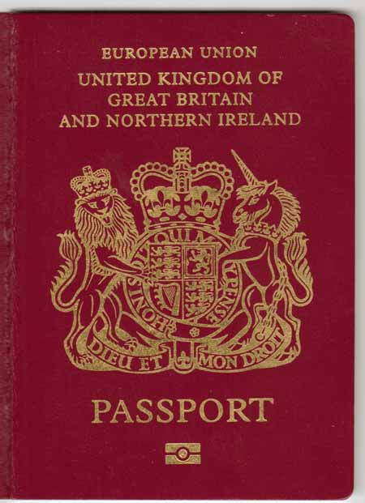

Week One
========

Lecture 1
---------

*Lecture: Mon 27th January 2014  -  Today: Thu 20th February 2014*

[Audio Recording](audio/Lecture_1.mp3)

-   [Syllabus](https://secure.ecs.soton.ac.uk/module/1314/ELEC6032/11296/syllabus)
    pretty much same as last year
-   [Denis](http://www.hpcc.ecs.soton.ac.uk/~dan/) will do all teaching
    (\>50%)
-   [Basel](https://secure.ecs.soton.ac.uk/people/bh9) will do all
    [examination](https://secure.ecs.soton.ac.uk/module/1314/ELEC6032/11296/pastpapers)
    & most of the coursework

### What's Interesting?

-   Interesting crypto is to do with public key cryptosystems
-   Symmetric key systems -- in which there is a single key shared
    between the communicating parties -- are pretty well understood
-   Block ciphers are no longer interesting, AES is great, job done!
-   Stream ciphers are a little more interesting
-   RSA is good, but anyone who is anyone is working with elliptic
    curves

### What Will you get out this module?

-   Right now, you should understand most of the basic ideas
-   You will learn more about the basic mathematics behind it
-   Know where the field is heading

#### Elliptic Curves

-   Should be able to understand how to use elliptic curve library
-   Should understand where you would begin in designing a new library

#### Identity Based crypto

-   Based on the mathematical concept of pairing
-   Use a publicly known fact as your key (e.g. email)
-   Usually you use a random key
    -   4096 bits please
    -   2048 is probably fine
    -   256 bits won't be enough

#### Problems

-   Core cryptography (AES, RSA, Elliptic curves) are secure, from what
    we learned in the Snowden leaks, governments can't crack them
-   Instead we look for flaws implementations and protocols are used to
    break them
-   Often attack the random number generator
-   The numbers in many protocols need to be cryptographically secure
-   Turning maths to code is hard
-   There are lots of attacks on protocols
-   Standards bodies aren't good at crypto
-   Sometimes they are told by NSA to include a backdoor..

### Maths

As previously mentioned, there is a lot of maths in this module. Here is
just a small taste!

#### Group theory

-   Abelian groups
-   Modular arithmetic
-   Discrete logarithms
-   Finite Fields
-   Extension fields over the binary field (Strings of bits)

#### Random Number Generation

-   Generation of pseudo random bit streams (LFSRs)
-   One of the biggest attacks on cryptosystems today
-   Very easy to break
-   Still widely used (e.g. MiFare cards are particularly bad)
-   Some RNGs are so bad that once you know one number, you can predict
    more in the series
-   There are problems with some processors (Intel...)

### Fuzzing

-   Feed random data to the program, and see what happens
-   Wait for it to crash
-   Now you know there is a vulnerability
-   You could do Denial of Service (DoS)
-   But you are better of trying to find a cool exploit
-   If you send in a carefully crafted random input, you can workout
    where things are overflowing to, and design some pretty nasty binary
    exploits.

### Side Channel Attacks

Attacking something other than the algorithm itself. During
implementation, a lot of care must be taken to avoid side channel
attacks. There are a huge number of side channels that can be attacked:

-   Timing attacks
-   Measuring power assumption
-   Acoustically listening to the CPU fan
    -   Doesn't even require any special kit
    -   Standard laptop microphone
    -   Force it to do loads of public key crypto
    -   Profit

### Block Cipher Modes

Choosing the correct mode can make a big difference to security. A given
block cipher can be used in many ways to produce ciphertext:

#### Electronic Code Book (ECB)i

-   Is bad
-   Split message into blocks, and apply to each block independently
-   Just a monoalphabetic cipher :(

#### Cipher Block Chaining (CBC)

-   Is Better
-   Previous output used as input
-   Not as good as we once thought
-   TLS has a few problems with this
-   Cribs associated with cookies??
-   When TLS broke we started using RC4
    -   RC4 May be even worse than CBC
    -   WEP misused it and got burned
    -   And there are fears that the NSA has some exploits it can use

#### Galois Counter Mode (GCS)

-   Is even better!
-   But uses serious mathematics

### Tangents

As we all know, Denis has a habit of wandering off topic just a little
bit. These anecdotes often are relevant, but for a document like this,
do interrupt the flow somewhat. As such, I have attempted to isolate the
anecdotes from the main concepts that need to be understood.

#### Smart Cards

-   MyFare cards used by the university
-   Consists of two parts
    -   Unique ID -- lets you into buildings
    -   Encrypted data -- Gives you pass for gym & bus (etc.)
-   They are quite easy to crack; Pt II Secure systems class did it
-   You can't change the unique address unless you buy dodgy ones

-   My fare have a big issue with their RNGs
-   Problems with RNG in embedded systems are a common problem
-   Powered by magnetic induction from the reader
-   Don't gather much entropy
-   Random numbers aren't all that random
-   Power them up too fast and you'll get one of three random numbers
-   MyFare Classic has been replaced by MyFare DESfire

#### Lock Picking

-   Lock picking is a big hobby at
    [MIT](http://www.lysator.liu.se/mit-guide/MITLockGuide.pdf)
-   Buy a couple of union locks and take the pins out to practice the
    nack
-   Most house door locks are really insecure
-   You have to be physically there to open a physical lock, a physical
    plod could come along and physically arrest you

#### Taiwanese National Identity Card

**Assertion: Taiwan is the politically correct name**

-   Gave a card out to each of the citizens
-   Generated a public key, private key pair (RSA)
-   Kept the private key on the card
-   The random number generator did self testing. This is meant to
    checks the randomness
-   The company that programmed the cards didn't use the testing
-   So they ended up producing a very small number of random numbers
    -   All Zeros
    -   'The next prime'
-   This resulted in a large number of Taiwanese ID cards with the same
    Private key

#### Debian SSL

-   OpenSSL tries to generate randomness for generating key pairs
-   The maintainer decided he would clean up the code a bit
-   Automated test tools including
    [Purify](http://www-03.ibm.com/software/products/en/rational-purify-family/)
    (Valgrindy type thing)
-   Fixed the uninitialized variables
    -   This killed the entropy
    -   This resulted in only 32,000 public key pairs being used
    -   Published in a small
    [text](http://pentestmonkey.net/blog/metasploit-ssh-key-database) file
-   Quite widely used on web servers ⇒ many are still around
    -   Chemistry still haven't fixed it

#### RSA's Be Safe library, will come up later...

#### Ross Anderson's Passport Nationality Identification

-   Symbol on the front, tells us it has an RFID chip in it
-   The global standard doesn't actually define what you should put on
    it...
-   RFID chip contains the data that is printed inside the passport
    -   JPEG image of the picture
    -   Maybe some fingerprints
    -   Date of Birth
    -   Name
    -   Passport number, etc
-   The key is printed inside the passport, on the page with the picture
-   The reader OCRs the key when you use the machine
-   Machine compares the image on the passport with the image from a
    camera
-   In reality this is done by a human operator
-   ***PAY NO ATTENTION TO THE MAN BEHIND THE CURTAIN***
-   There is an international standard on how to do this stuff
-   But: Each government will implement the specification themselves
    -   National contractors used, you don't want a spy making it
    -   Promote domestic technology!
    -   Can't trust the Americans! (or anyone really...)
-   Thus, all the chips behave in a slightly different way
-   Notably the response time
-   By timing the responses you can work our someone's nationality based
    on timing
-   Blow up a dustbin when an American (Brit or Israeli) walks by

#### Dropmire

[Slides](http://www.hpcc.ecs.soton.ac.uk/~dan/talks/DarkSideOfTheMoon/DarkSideOfTheMoon.pdf)

-   Technique used by NSA to read the fax at the UN
-   The Guardian published a slide
-   Training slide contains a real picture of it
-   It is obvious what is going on:
    -   A fax that has been Left to Right edge detected
    -   The signal has been differentiated
    -   This won't have been done in software
    -   Looks at the current in the laser diode
    -   NSA are stealing electrical signals!
-   There is a standard (code book tempest) about not radiating these
    signals
-   CRT monitors were particularly bad at radiating ⇒ LCDs aren't too
    bad
-   Either:
    -   EU used non tempest printers
    -   Stubborn a fax maintenance guy
-   All you need to do is stop a screw from being grounded
-   Not accountable, screws come loose all the time
-   Tempest side channel attacks used to be a big dealio

#### WEP

-   Wired Equivalent Privacy
-   This is true if you assume the attacker has access to the wire
-   WEP broke because RC4 was used incorrectly
-   Problems with initialisation vectors
-   Most of the people who used to run WEP had all their money taken and
    don't have computers any more

### Past Exam Papers

-   If you don't like the look of these, you might want to drop out
-   Ben DF shows how much he knows about Fields
-   People tend to take the mathematical questions in the exam
-   No one does the recreational cryptography questions
