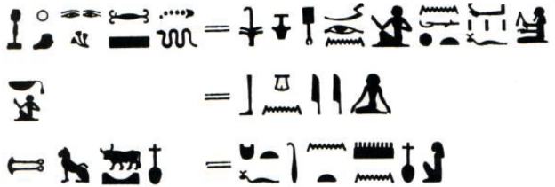

Lecture 3
---------

*Lecture: Thu 30th January 2014  -  Today: Tue 18th February 2014*

-   *My recording missed the first fe minutes of this lecture, if anyone
    knows what he said, [pull requests are
    appreciated!](https://github.com/edderick/crypto_notes)*
-   Error correcting codes go inside?
-   Often you want to keep the amount of traffic low so you can't tell
    stuff is being sent
-   Steganography is used to hide the fact that you are communicating at
    all:
    -   Maybe you're a spy
    -   Or a terrorist
-   British civil service used to hide messages in a rock:
    -   Bluetooth rock
    -   All the locals knew about it

### Some Definitions

#### Plaintext

The message that you are trying to prevent from being read. We also want
to guarantee correctness

#### Cipher

Something that operates on characters, doesn't know the semantics of the
message

-   Ex: Monoalphabetic substitution, caesar shift: \
     QEB NRFZH YOLTK CLU GRJMP LSBO QEB IXWV ALD
-   When ciphers are being created, the designer doesn't need to know
    anything about the application domain
    -   This is good because you can get someone to make you a cipher
        without disclosing what you are going to use it for
    -   Or you can just buy it off the shelf..

#### Codes

Rely more on the higher level semantics of what is being sent
"Codewords"

-   Semaphore codes at the battle of trafalgar
    -   England expects every man to do his duty
    -   England is in the code book, duty is not
-   Often codes don't actually aim to keep things secret
    -   Ex: French delicatessen:
    -   Code words for goat, cheese and bread - restricted to that
        domain

#### Nomenclature

A mix of both?

#### Homophones

-   Several possible code words that mean the same thing
-   Can make it tricky to work out what the cipher text means
-   We could mitigate against frequency analysis by having many more
    symbols for 'e' than for 'z'

#### Code Book

-   Contain the significant words used for confidential communications
-   The modern day corollary is keys

#### Monoalphabetic Substitutions

-   Replace a given character with a different character from a lookup
    table

##### Russian

-   Basically a substitution cipher
-   The court language was French
-   Religious language was Greek
-   Modern Technical words are English
-   Character set is derived from Greek (Cyrillic)

#### Polyalphabetic substitutions

-   e.g. Enigma
-   The position in the text determines the substitution

### A Brief History of Cryptography

#### The First Cipher

-   The very first cipher known was the crazy Egyptian one where they
    wanted to make it look more important
-   In the modern day it's done in morse code on posters

#### Caesar Shift

-   The Caesar cipher is important
-   Replace each letter with the letter three spaces along
-   (Often used to refer to any number rotation)

-   Caesar rotations are easy to crack
-   Very small key space (26-1 distinct keys..)
-   Once you crack one letter you've cracked them all
-   You can have a more generic substitution by allowing a code word

#### Nomenclature in the Vatican

-   Nomenclature was used by the vatican
-   They used to all talk in latin
-   And then had a load of code words that they would use
-   Plus homophonic substitution
-   Funny twiddly things to change the meaning of words, or remove their
    meaning completely

#### The Babington Plot

-   Lead to the death of Mary Queen of Scots
-   Found out about her plot
-   Then didn't just kill her, but changed the messages
-   From this they discovered more of the conspirators

#### Vigenere Cipher

-   Secret keyword
-   Can use a square (or just do it by converting letters to numbers and
    doing addition)
-   Uses multiple different letter substitutions
    -   This is good because we can no longer see bigrams
-   There is quite a large number of key words

-   To crack a vigenere cipher, we need to find out how long the keyword
    is
-   We can then do frequency analysis accounting for the stride
-   The problem is that we can crack in two stages:
    -   Find keyword length
    -   Work out each keyword letter in turn

##### Kasiski Examination

-   By chance a word may be enciphered using the same letters of the
    keyword
-   If this is the case, we can narrow the keys down to those that are
    factors of the distance between the repetition

##### Friedman test

-   We use the index of coincidence (a sum of the frequencies of the
    letters)
-   "Spread of letter frequencies"
-   We set the stride to n, and see if the distribution of the frequency
    of letters matches what we would expect for that language
-   We don't care which letter is most common, but we care that the most
    common letter is about as common as the most common letter of the
    language of the text
-   If we find a hit, we can be pretty sure the key is that length
-   And then we can use frequency analysis across that key
-   I think some fancier maths can be used to do cleverer things... :\^)

#### Venona Ciphers

-   Venona ciphers used carbon paper for their one time pads
-   If you see two ciphertexts that are the same, then you will have a
    strong suspicion that keys are being reused
-   Try messages against each other in the attempt to find messages with
    the same key
-   When two messages have the same key, the keys will cancel out upon
    XORing
-   When the American broke the Russian cipher, it took them many years
    to get all the information they were after out of them (rounding up
    spies etc.)

### Solving a Simple Monoalphabetic Substitution as a Class

-   We used frequency analysis and semantic analysis
-   Bigraph analysis - we often see the pattern Consonant-Vowel

### Uncategorised Comments

Old fashioned paper ciphers may use the minor features to convey the
message, rather than the gross features:

-   e.g. Duck or woman, no difference, look at where the legs are
    pointing

\

In the old days GCHQ would hire lots of linguists

That and people who liked crosswords

\

Context can be very helpful
