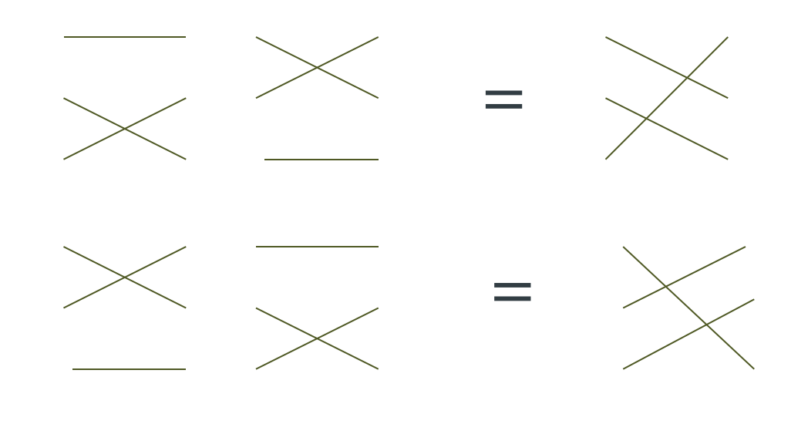

Lecture 9
---------

*Lecture: Thu 13th February 2014  -  Today: Tue 18th February 2014*

**Disclaimer: I didn't go to this lecture, so I never saw the board,
which makes mathsing a little diffictult. :(**

- NSA aren't great at keeping hold of their secrets
- Edward Snowden is uncommon in that he didn't try to profit 
- Vietnamese were intercepting all their US radio traffic during their war
- Although we always talk about our successes, there are actually a fair few failures..
- Denis is now looking at book prices...
- Although there are good results by the code breakers in capturing enemy
  secrets, the operational side still tends to be weak, and doesn't adapt to
  the fact that they are just as insecure as the enemy
    - It is common for both sides in a war to be reading each other's traffic
- Always type your password wrong first ;-)

### Right! Back to the Maths!
- What's purple and commutes?
    - An abelian grape
- We have seen that there are two groups of size four
    - And that it would behave like vectors (a, b) under addition mod 2
- Can also prove that addition of vectors is a group if the elements are groups
- It is often a good way to check for associativity by mapping into vectors
- When we do this contracting stuff we must check:
    - Addition is consistent -- when we bunch things up, it mustn't get scrambled by the operation
    - It is closed
- The Klein group 
    - The same Klein that made the Klein bottle
    - Don't put beer in a Klein bottle

#### Permutations

- Another classic way of describing a group is as a set of permutations
    - If you have 3 objects and swap the bottom 2, thats an operation
    - Is associative because its operating on a thing
- Associativity means that it would be performable on something
- BUT - if we do it in opposite orders then we don't get the same result!
    - It is NOT commutative
- Groups &lt; 6 MUST be commutative
    - = 6 there are exactly 2 groups:
    - one is commutative, the other is not
- For all finite sized there is at least one commutative group: the cyclic group
- If the number is prime, then there is only the cyclic group
- If the group has a lot of small factors, the group can be very rich and complicated
- We can also represent groups as matrices
    - A faithful representation 
    - There is a mapping from group elements to matrices which obeys the group laws
    - A simple way to make a faithful representation is to treat is as a subset on the elements?
    - This is like currying the binary operation? Ha
    - Zeros everywhere except for one one in each row, and one one in each column
- Easy way to show something is a group
    - Find some matrices to represent the group 
    - Associate a matrix with each group element
    - Now show the matrix multiplication obeys the group laws
    - Matrix multiplication is associative - Done.
- Permutations and symmetries
    - Permutation of 4 elements 
    - Is the same as the symmetries of a cube
    - You can apply this to crystals -- Snowflakes
- Checking associativity by hand is a bit painful
    - Try to avoid it
    - It would be okay to find a counter example
- Every group is a subgroup of the group of the permutations of its elements
- Two dimensional rotations form commutative groups
- Three dimensions don't
- The full set of 3D rotations is the set of 3D orthogonal matrices with determinant 1
  
- Let's see what we can do with multiplication modulo 7
    - 0 : Set of numbers of the form 7n 
    - 1 : Set of numbers of the form 7n + 1
    - 2 : Set of numbers of the form 7n + 2
    - .....
    - 6 : Set of numbers of the form 7n + 3
- ex : 0 -> 7, 14, 21; 2 -> 9, 16, 23
- If we multiply two together we get:
    - ex: 2 * 3 = 6
    - ⇒ (7n + 2)  * (7m + 3) = 49nm + 2 . 7m + 3 . 7n + 2*3 
    - The ms and ns go away?
- The class 0 is unhelpful - it doesn't have an inverse
    - We just get rid of zero
- We need to show that this group is just a relabeling of one groups we already know
- In the example, we checked the commutativity
    - The multiplication table was not symmetric about its diagonal 
- We check if it is generated by 1?
    - Find an element that has 6 steps to return the identity

