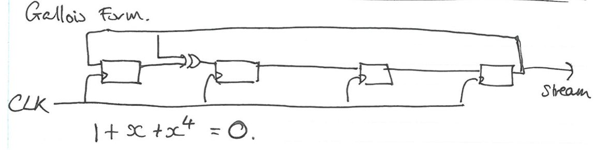
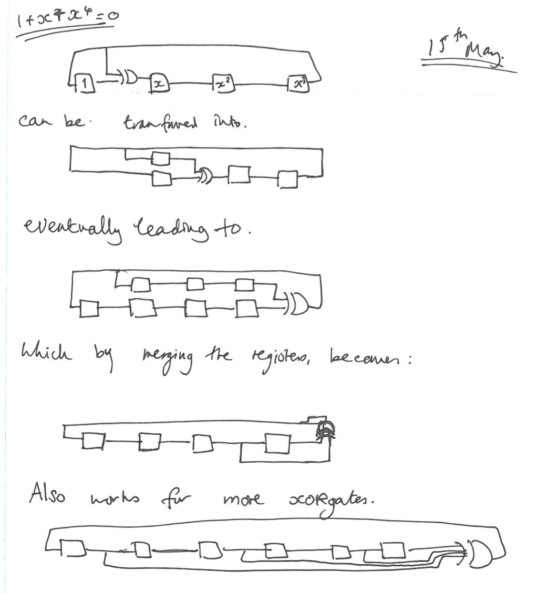

Lecture 24
----------

*Lecture: Tues 25th March 2014  -  Today: Thu 15th May 2014*

- Irreducible polynomials 
- x4 + x2 + 1 = 0
    - Odd number of terms, implies x = 1 not a root 
    - Has a 1, implies x = 0 not a root
    - Thus it has no linear factors 
        - Only linear options 1 and 0. 
    - Does it have any quadratic factors? 
        - Only irreducible polynomial of degree 2 is:
            - x2 + x + 1
        - (x2 + x + 1)2 = (x2)2 + x2 + 12 + 2x2x + 2x1 + 2x1
        - 2 = 0, so this leaves us with x4 + x2 + 1
    - If I have a field of characteristic n
        - 1 + 1 + 1 + ... + 1 = 0 (n times)
        - If we have some polynomial p(x)
        - Then pn(n) is the same as evaluating the polynomial at xn
        - This is a result of the binomial theorem 
            - All the terms other than the leading term disappear
- Take a field of characteristic n, F
    - And replace each element with its nth power: x -&gt; xn
    - You get a new field 
    - Because multiplication still words:
        - (xy)n = xnyn
        - (x + y)n = xn + yn
            - because all the cross terms have an n in them, which is zero
    - This is called the Frobenius Endomorphism 
    - Don't worry, this isn't actually that important right now...
- Polynomials over the binaries
    - If polynomials is of the form (some other polynomial of x)2
    - Then it is not irreducible
    - P(x) = Q(x2) == (Q(x))2
    - Any polynomial that contains only even powers of x is reducible...
- Quartic polynomials with no linear factors:
    - x4 + x3 + x2 + x + 1
    - x4 + x3 + 1
    - x4 + x + 1
    - x4 + x2 + 1
        - The last one has a quadratic factor, so is reducible
- You often want it to be primitive as well
    - Primitive -- Generates the whole of the multiplicative group
    - In this case, x must have order 15
    - e.g. x4 + x3 + x2 + x + 1 
        - we have: x
        - x2
        - x3
        - x4 = x3 + x2 + x + 1 Because with booleans signs don't matter
        - x5 = x(x4) 
            - = x(x3 + x2 + x + 1) 
            - = x4 + x3 + x2 + x
            - = x3 + x2 + x + 1 + x3 + x2 + x
            - = 1 (Oh no! The identity!)
        - This polynomial is not primitive!
        - Group of size 15
            - Multiplicative field is cyclic
            - Order of the group must divide that of the group:
                - 1, 3, 5, or 15  
                - The group above has order 5, which is a legit group.
    - If we can get past 5, then we are fine :D
    - e.g. x4 + x + 1
        - we have: x
        - x2
        - x3
        - x4 = x + 1
        - x5 = x(x4) = x(x + 1) = x2 + x 
        - We could continue, but we know it will get to 15, because the order must divide the group
        - Woo x is a generator! As such, it is primitive.
- x4 + x + 1 = 0
    - Let's consider another element of the field: y
    - y = x-1 -- is the inverse of x
    - y-4 + y-1 + 1 = 0
    - multiply both sides by y4
    - y4(y-4 + y-1 + 1) = y40
    - 1 + y3 + y4 = 0
    - which we can write as  y4 + y3 + 1 = 0
    - Polynomials come in pair
        - This is a pair of primitive polynomials
        - If one is primitive, so is the other
        - If one has order 15, the other has order 15
        - Basically just goes round the other way...
- Any polynomial that is not symmetrical, has an inverse polynomial. 
- This looks like a pretty good way to generate some random numbers...
- 
    - Probably don't need a clock on the diagram...
- LFSR Time
    - Build a shift register as the multiplier
    - Four elements in the example 
    - Number the different blocks to be 1, x, x2, and x3
    - Multiplying by x, corresponds to clocking the shift register
    - If our register is set to one, and we clock it, it becomes x
        - Clock it again, and it becomes x2
        - And again, it becomes x3
    - When we clock out the end, we have to respect the polynomial
        - In our example we pick 1 + x + x4 = 0
        - So when we clock out the end, we generate and x4
        - which means we have to subtract (1 + x)
            - To satisfy the law of the field
            - THIS IS BECAUSE:
                - We don't have to carry x^4 with us
                - Whenever we see x^4, we can add or subtract (x + 1)
                - because of course x4 = 1 + x, by simple rearrangement
            - So when we carry out x^4, we add that back in to x and 1
    - If we simply clock out the x^4 and into the 1 we get the polynomial 1+ x4
        - That polynomial wasn't very interesting, because it isn't irreducible
        - We want to also shift in the x
        - We do this using and XOR which between 1 and x 
    - We always have a clock out at the top and a clock in at 1
        - The XORs fill in the middle bit of the polynomial
    - For our example, we could have placed the XOR before x3 to clock in an x3
        - This is also irreducible, and clocks in the opposite direction 
        - (We showed above that these two polynomials are inverses)
    - Even powers of two are a warning sign...
- To use an LFSR to encrypt a message
    - Take the stream of bits that comes out of the end
    - And XOR this with the bits of your plaintext (bit serialised)
    - To decrypt, take the same bits from the LFSR and XOR with the ciphertext
    - It's a stream cipher
- You can easily get long sequences you can get
    - Variety of different polynomials
    - Variety of different initialisation states
    - DON'T INIT TO ALL ZEROS!
- Some crap about optical cables...
- Use a best guess at the plain text, in hope to get the key stream
    - Standard headers for messages are a good place to start
    - Use a lot of guesses! 1012 guesses maybe
        - You have a big computer after all!
    - Out the end pop 10^12 guesses for the LFSR output.
    - There is a very fast algorithm, that when given 2nbits can determine the configuration of an nbit LFSR 
    - n = 48 on MyFare classic...
    - Ah the fables Berlcamp-massey algorithm...
    - BM is so fast, that you can do many many guesses
- Denis's classic anti LFSR rant
- New tricks are always appearing to analyse fields over the binaries.
    - This includes AES... :(
- Never use the same bitstream twice you silly billy
- Using a dodgy stream is also a bit of a problem
- What we have seen so far is a Gallois Form LFSR
    - These fields we have been looking at are called Gallois Fields (GF)
- There is also the Fibonacci version
    - Related to the Fibonacci sequence (recall from your childhood)
    - We take a weighted sum of early elements of the series to get the next element in the series
    - We can move the XOR gates around, without changing the output
    - Have to put delays in
        - Like building a balances pipeline..?
    - Can keep doing this 
    - We end up with the opposite taps from what you might expect
        - Polynomial is 1 + x3 + x4  = 0
    - By sliding down, we reverse the position of the taps
    - BUT THE COUNT IN THE SAME DIRECTION...
    - So when switching from Gallois to Fibonacci, you reverse the polynomial to get the same output
        - Otherwise you will count backwards 
- 
- This is now a linear recurrence
- At time t=0 output is S0
- At time t=1 output is S1
- At time t=2 output is S2
- At time t=3 output is S3
- This is a different sequence from before...
- Using low order recurrence to make it simple
- So in general   
    - Sn = Sn-4 + Sn-3 For n &ge; 4
    - e.g. S4 = S0 + S1
- It isn't the Fibonacci recurrence, but it is a linear recurrence 
