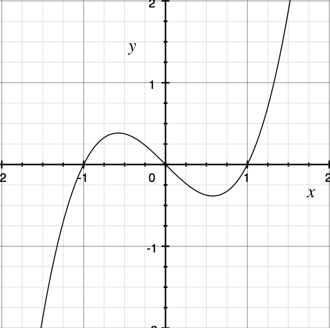
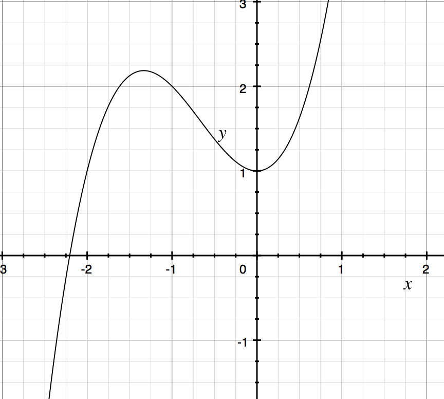
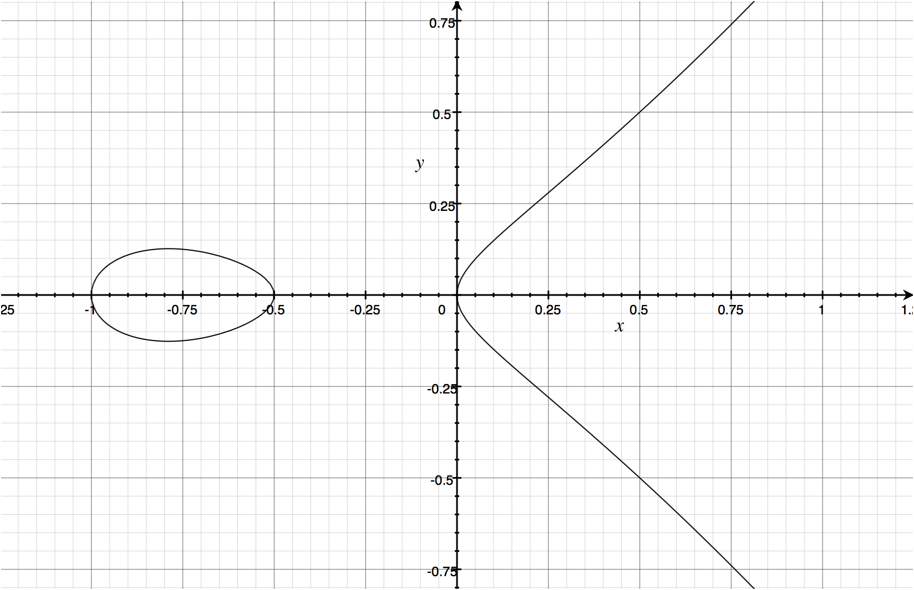
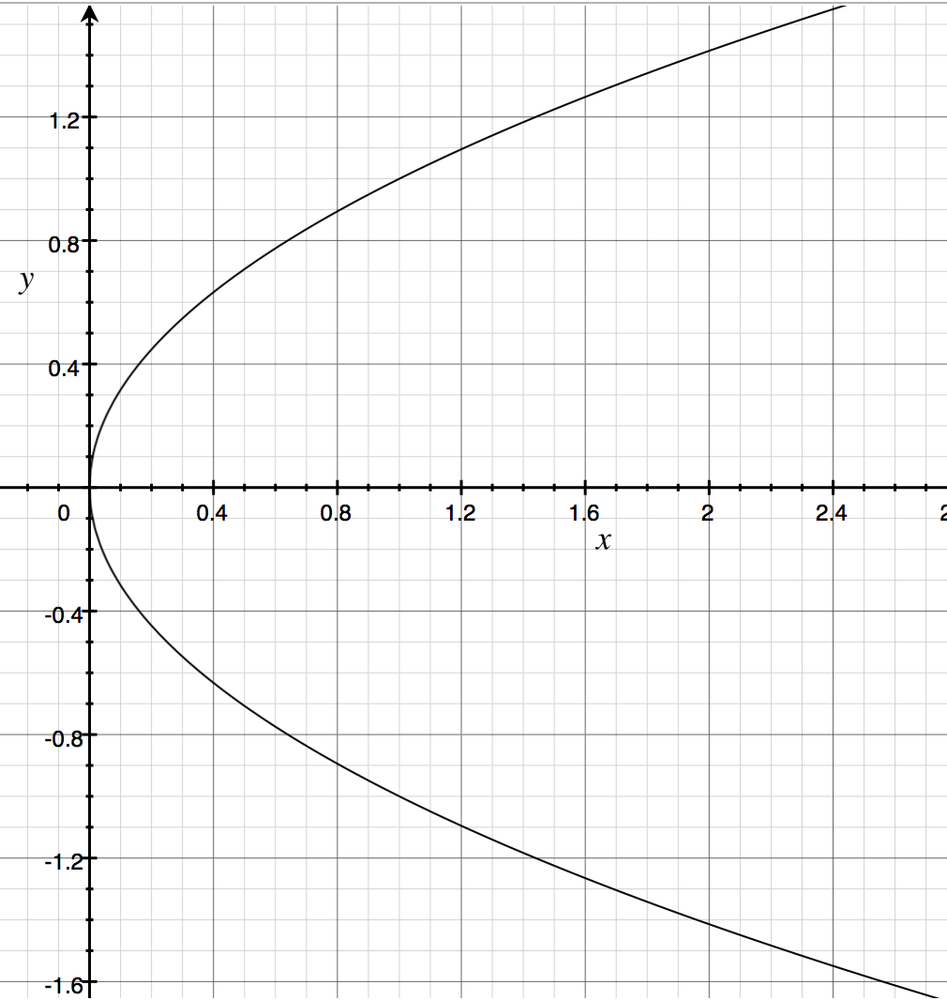

Lecture 26
----------

*Lecture: Mon 28th April 2014  -  Today: Thur 15th May 2014*

- Kazakhstan is great
- The Wikipedia page on Elliptic curves is pretty good! 
- We're going to start with a fun example...
- Cannonballs
    - They come in flat square trays of y*y = y2 
    - And you stack them in pyramids 
        - 1 + 22 + 33 + 42
        - x(x + 1)(2x + 1) / 6
    - We want to find good number of cannon balls to order, such that:
        - they fit in a tray, and they can be stacked in a pyramid 
    - So this gives us:
        -  y2 = x(x + 1)(2x + 1) / 6
        - or: 6y2 = x(x + 1)(2x + 1)
        - or: 6y2 = 2x3 + 3x2 + x
    - We want an integer solution to this problem
    - Some simple solutions:
        - (0, 0)
        - (1, 1)
        - After that it gets a little harder...
        - BUT THESE NUMBERS AREN'T BIG ENOUGH!
    - This line is a cubic, so it can only have 1 or 3 real roots
        - If it has two roots, we know there is another root
        - And the third root must be real 
        -  
        -  
   - We have:
        - C1 = 2x13 + 3x12 + x1
        - C2 = 2x23 + 3x22 + x2
        - This particular curve looks like:
            - 
            - Has zeros at: -1, -1/2 and 0
            - It is obviously symmetric; given y2 = x
            - 
    - 2x3 + 3x2 + x = 0
        -  has roots at 0, -1 and -1/2
        -  The leading x is positive:
            - Tends to infinity on the right
            - Tends to minus infinity on the left
        - When the line passes through the origin, the gradient appears to be infinite
            - There is no kink...
- With this curve, we have three rational roots
    - Although this is not required!
    - If we have two rational equations
    - We know we have the solutions x = 0 and x = 1
    - We can make use of some crazy maths...
    - 2x3 + 3x2 + x = 0
        - We can divide this though by two: x3 + 3/2x2+ x/2 = 0
        - The value 3/2 is the sum of the roots...
        - (x - &alpha;)(x - &beta;)(x - &gamma;)
            - expanded to: x3 + (&alpha; + &beta; + &gamma;)x2 + (&alpha;&beta; + &beta;&gamma; + &alpha;&gamma;)x - &alpha;&beta;&gamma;
        - The other coefficients are:
            - minus sum of roots
            - minus products of roots
        - And that's how you can work out the roots with ease ;)
            - If we have two real rational roots, so is the third!
- Recall some interesting fields:
    - Field of rational numbers + - * / 
    - Field of algebraic numbers: roots of polynomials
    - Field of real numbers: includes limits of series (pi, e)
    - Field of the complex numbers: add in i as srqt(-1)
- Whatever field the coefficients are in, and two of the roots:
    - The third root will be in the same field! 
    - How exciting!
- Time for some lines 
    - Consider the line y = x, as a straight line 
    - We can simply substitute this in:
        - 6x2 = 2x3 + 3x2 + x
    - Wooh, simultaneous equations
    - This is the equation of the intersection of the line with the curve
        - Intersects at (0,0), (1,1)
    - The points might not all be rational
    - But in this case they had to be, because the other two were
    - We already know x = 1 and 0. And now we learn 1/2
        - Because 0 = x3 - 3/2x2 + x/2
        - And 1 + 0 + 1/2 = 3/2
- Can use any old coefficients, and find two rational points
    - By drawing a line through them, we can work out a third point! 
- The whole thing reflects in the x-axis, so we known there is another point below the x-axis
- Back to our cannonball problem...
    - We want a nice big pile of cannon balls
    - We want x to be positive, but don't mind about y
    - For our problem, we only need to look at the top right quadrant
    - We already worked out some crappy answers, but let's to get some good'uns
    - So we draw a straight line to get another intersection
        - The new point will be rational (but may not be whole)
    - Denis says it is lovely that we can get rationals
- Looking at the line through (1/2, -1/2) and (1, 1)
    - Recall: the equation for a slope (y2 - y1) / (x2 - x1)
        - This gives us (1 - -1/2)/(1 - 1/2) = (3/2)/(1/2) = 3
    - Recall: the equation of a line y = mx +c
        - This gives us y = 3x - 2
        - You might want to check this...
- We sub this back into the equation of our elliptic curve, to give:
    - 6 (3x - 2)2 = 2x3 + 3x2 + x 
    - Which is 6(9x2 - 12x + 4) = 2x3 + 3x2 + x
    - So: 0 = x3 + ((3 - 54) / 2)x2 + DON'T CARE
- 51/2 = the sum of the roots
    - 51/2 = 1 + 1 + 1/2 + x3
    - 48/2 = x3 = 24
    - Knew this would be rational
        - Didn't know it would be whole though
- Turns out that for this example:
    - We can keep doing this over and over and we will never see another whole number
- There is a theorem, that shows that denominators get bigger
- Time to work it all out
- Subbing back into the straight line: 
    - y = 3*24 - 2 = 70
    - (I checked because I'm dumb and it also works in the elliptic curve equation)
    - This means 1 + 22 + 32 + ... + 242 = 702
    - So, we can arrange 4900 in nice piles and squares.
- There are some other things that are interesting... 
    - Need to make sure the curve really is an Elliptic curve
    - y2 = x3 + ax + b
        - You can get to this by rescaling x and y appropriately
    - Must be non signular
        - Must have three distinct roots
        - Recall: Quadratics require b2-4ac != 0
        - Similar for Cubic:
            - &Delta; = -16(4A2 + 27B2) != 0
            - If this isn't true, BAD THINGS HAPPEN
            - You end up with pretty odd shapes... :/
    - If two points are in the same place, we can draw a tangent line that intersects the line
        - So we can get by with a single point
        - EXCEPT: when the tangents are verticle -- and we go straight to infinity
        - y grows faster than x...
        - We call both points at infinity 0... Because we are insane.
            - positive and negative infinity are the same
        - To prevent this being a problem, you can write
            - y2z = x3 + Azx2 + Bzx
            - and the points on the curve are (x, y, z)
            - which can be written (ax, ay, az) = (x, y, z) which are not all zero. 
            - Projected coordinates -- don't worry about this
- Every line intersects three times
- If you do it in complex numbers, you end up with a torus. :)

###Summary
- Can add two points and get a third point
- Can use tangents to get a second point
- If the tangent is vertical, we get the point at infinity
- This is useful for ordering cannonballs!
- Pure mathematicians love 'em

###Tangents
####MWR
- This is not a hard rock t-shirt!
- It's an MWR t-shirt
- And (other) Dennis is going to work there as of September

####Nuclear War
- Denis used to get to go in cool bunkers
- But alas no more
- Has Russia invaded Ukraine yet?
