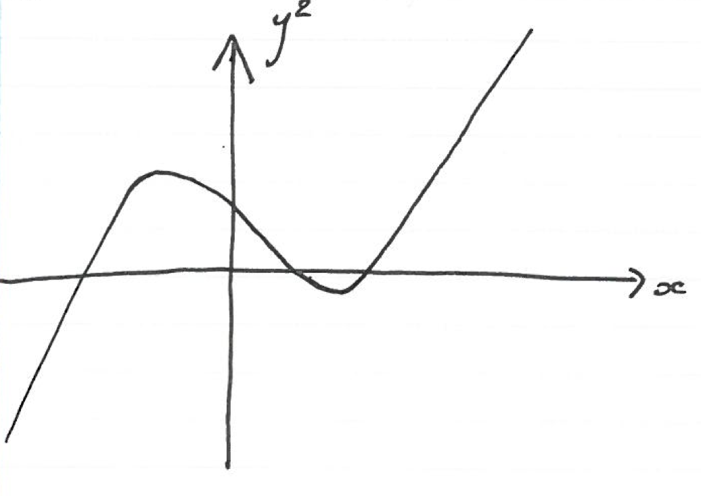
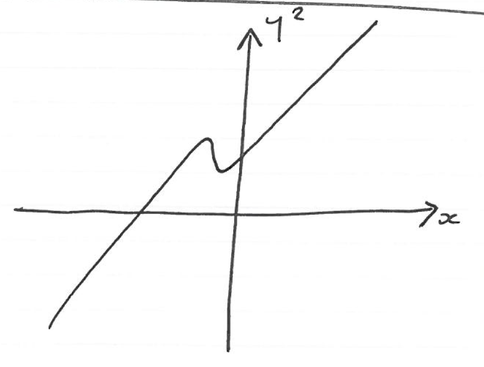
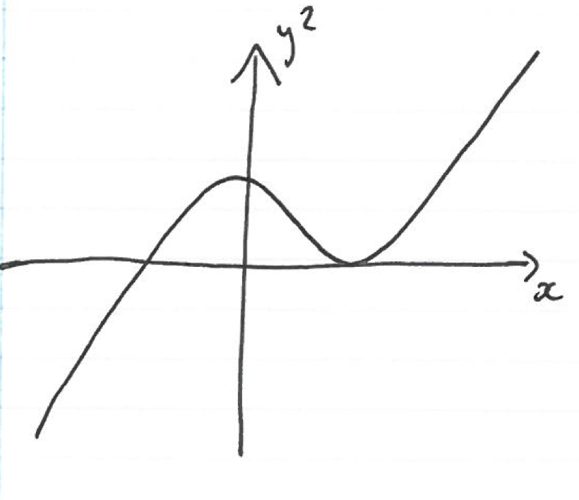
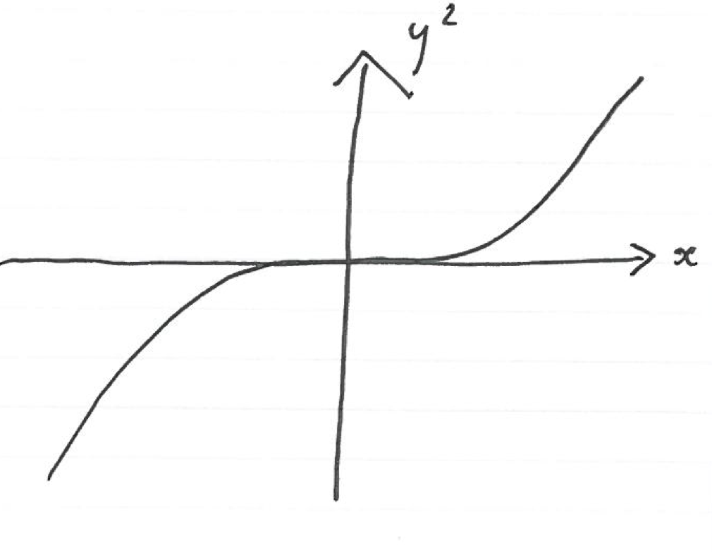
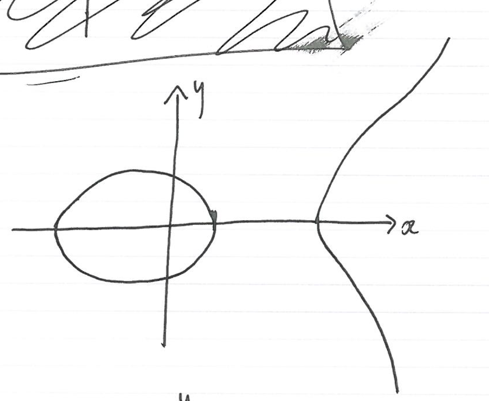
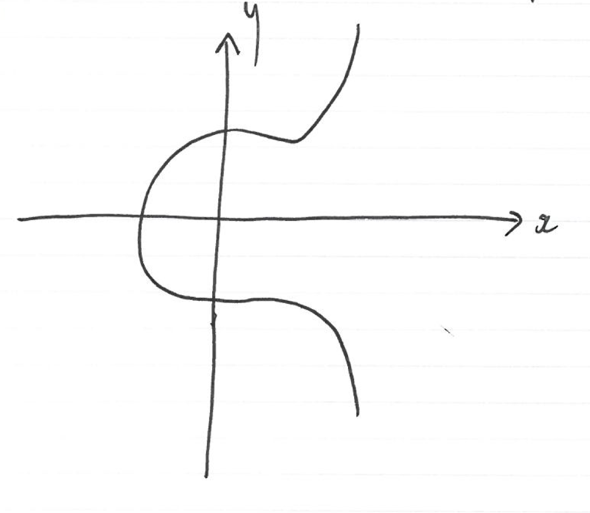
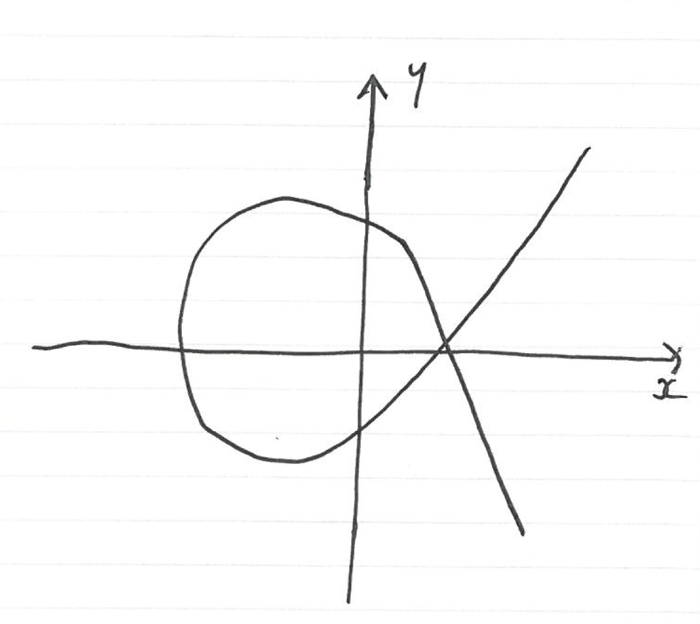
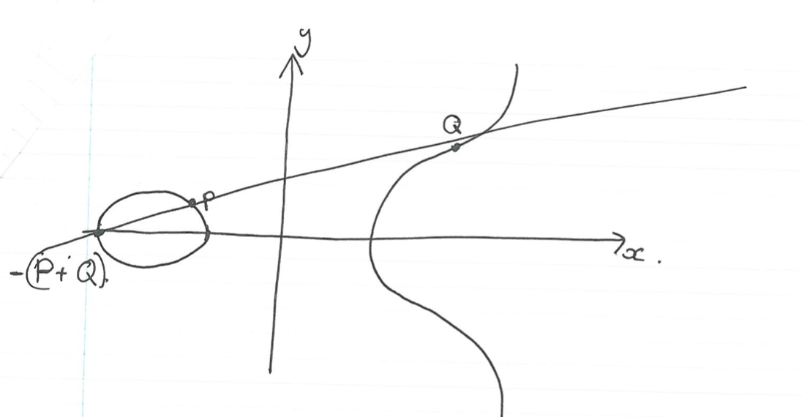
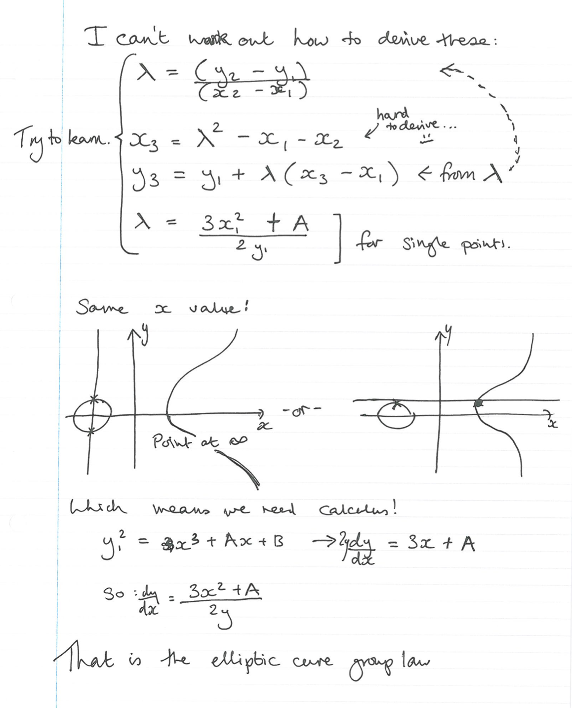
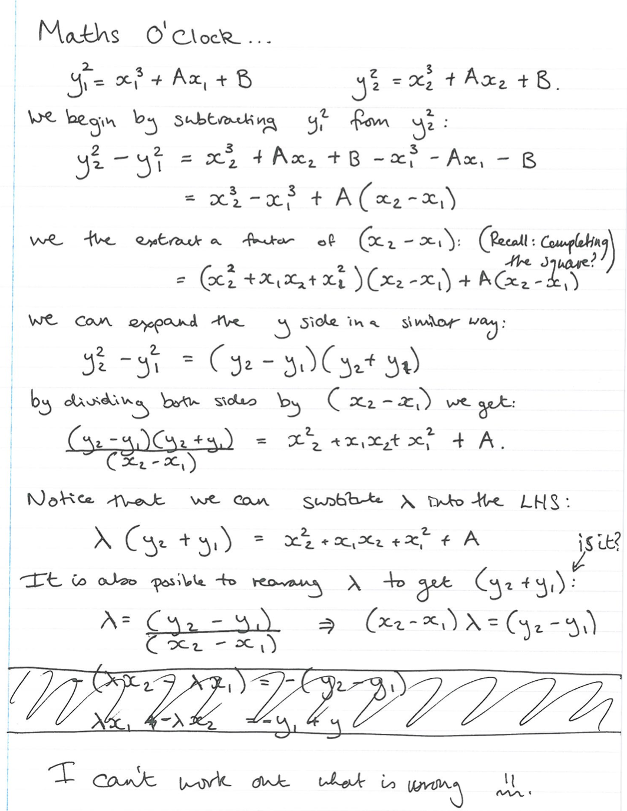

Lecture 27
----------

*Lecture: Tues 29th April 2014  -  Today: Thur 15th May 2014*

- y2 = x3 + Ax + B
- If we build any only cubic, with all kind of constants everywhere
    - By some linear transformations
    - We can get it into the above form
    - UNLESS the characteristic of the field 2 or 3
- There are some fields that have tricks that make the solution better
- Today: We are going to learn the full Elliptic Curve story!
    - There are other tricks that we aren't going to learn
    - But there are always new tricks being discovered
- Finite fields: 
    - All equality reasoning for normal numbers works
    - Inequalities do not: m &gt; n  doesn't imply m + 1 &gt; n 
- Peano's Axioms
    - One doesn't hold: The successor of a number could be a number we have seen before
    - Something you aren't allowed to do..
        - Prove 2 = 3
        - 2 * 0 = 3 * 0
        - so: (2 * 0)/0 = (3 * 0)/0 
        - so : 2 = 3
        - BUT YOU CAN'T DIVIDE BY ZERO!
        - Because division is multiplication by the inverse
            - And nought doesn't have an inverse!
    - This rule holds for the Binaries:
        - Prove 1 = 0
        - 2 * 0 = 2 * 1
        - so: (2 * 0)/2 = (3 * 0)/2 
        - so : 0 = 1 BUT 2 = 0, so you can't divide by it!
    - Need to be careful never to divide by zero!
        - Zero might not be obvious though  
        - Need to watch carefully through the derivation
- You can do all this stuff for fields of characteristic 2
    - You need some other rules
    - But it isn't a good idea anyway
- Iff &delta; = -16(4A3 + 27B2) != 0
    - Then we're fine, it is an elliptic curve
    - There are no repeating groups 
    - This is clearly nonsense for characteristic 2 and 3 
- If there are no repeated groups, It will look like:
    - 
    - 
- But it will not look like 
    - 
        - Because it has a repeated root
    - 
        - because it has a point of in inflection
        - The gradient vanishes...
- y2 = x is a sideways parabola
- We can get 
    - 
    - 
- But not 
    - 
        - This is a singular curve, and these are not allowed!
- Why aren't we looking at this in the complex plane?
    - Elecs might think that...
    - The story is quite intuitive if we do...
    - There are magical things called Elliptic filters
        - But I don't care!
    - Fermat's last theorem..
- The remarkable feature of Elliptic curves:
    - If we draw a line through any two points
    - It is guaranteed to meet the curve at one extra point
    - BUT THAT POINT MAY BE THE POINT AT INFINITY
    - There is a binary operation on the Elliptic curve
    - Our binary operator also reflects in the y Axis 
- Exiting feature
    - Can draw on the real line, and it is fine
    - But it also works on the rationals
        - If they are both rational, then the third point is rational 
    - If we have two points in a field, the result is also in the field
    - Wooh! Exciting.
- It works for finite fields as well
- 
    - The point at infinity is the identity
- The group 
    - Is Abelian 
    - It is commutative
    - It has an identity
    - It has inverses
    - It is closed (2 rational points gives another rational point)
    - And it has associativity
        - (A + B) + C = A + (B + C)
        - This is obvious if you use the complex plane...
- The reflection isn't strange...
- Three points on a line that intersect the curve add up to the identity?
- I hope you like maths, because you're about to get a firehose to the face of it
    - I have chosen to do this on paper, because fuck typing maths.
- 
- 
- The magic is that when we wanted to do DH key exchange
    - We wanted the discrete logarithm to be easy
    - Here discrete log is very hard! Significantly harder than finite field multiplication
    - Don't need such big numbers, lots of tricks don't work
- Pick a point on the curve:
    - Double it many times
    - To get a point to soem power 
- Can create point (x, y)n very quickly 
- Doubling and such

##Summary
- The group operation is a little harder
- The discrete log problem is a lot harder

