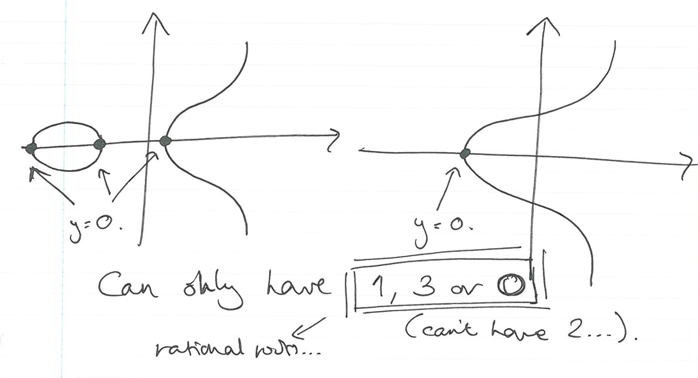

Lecture 28
----------

*Lecture: Thurs 1st May 2014  -  Today: Thurs 15th May 2014*

- &lambda; = (3x12 + A)/(2y1)
    - For point doubling (x1 == x2 and y1 == y2)
- &lambda; = (y2 - y1)/(x2 - x1)
    - For point addition  (x1 != x2 or y1 != y2)
- x3 + x2 + x1 = &lambda;2
- y3 = &lambda;(x3 - x1)
- You basically should be able to derive all of these
    - May want to remember 
    - x3 + x2 + x1 = &lambda;2
- For it to be an elliptic curve at all:
    - &delta; = -16(4A3 + 27B2) != 0 
    - No repeated roots 
    - With repeated roots it is more like a conic
- Finite fields time
    - It is not immediately obvious how big it will be
        - It is finitely generated 
- Our example: 
    - y3 + x + 1
    - For the Field F7
- <table><tr><th>y</th><th>y2</th></tr><tr><td>0</td><td>0</td></tr><tr><td>1</td><td>1</td></tr><tr><td>2</td><td>4</td></tr><tr><td>3</td><td>2</td></tr><tr><td>4</td><td>2</td></tr><tr><td>5</td><td>4</td></tr><tr><td>6</td><td>1</td></tr></table>
    - You will notice:
        - 0 is 0
        - But every other number has two square roots
        - This is because: 6 is really -1, 5 is really -2, etc.
        - You end up with a nice symmetric pattern
            - Almost half the numbers are perfect squares...
        - We can expect that:
            - 1/7 of the time, we have one sqrt (0)
            - 3/7 of the time, we have two sqrt (perfect squares)
            - 3/7 of the time, we have no sqrt (all others)
            - 1/7 + 3/7 *2 + 3/7 * 0 = 4/7
        - A naive guess for the size of the group is P + 1
        - The actual bounds is P + 1 +/- 2sqrt(P)
            - But maths is too hard...
        - We can check if it is singular, this is not.
- This table shows the steps for working out y2 = x3+ x + 1
- <table><tr><th>x</th><th>x3</th><th>x3 + x</th><th>x3 + x + 1</th><th>y</th></tr><tr><td>0</td><td>0</td><td>0</td><td>1</td><td>1 or 6</td></tr><tr><td>1</td><td>1</td><td>2</td><td>3</td><td>--</td></tr><tr><td>2</td><td>1</td><td>3</td><td>4</td><td>2 or 5</td></tr><tr><td>3</td><td>6</td><td>2</td><td>3</td><td>--</td></tr><tr><td>4</td><td>1</td><td>5</td><td>6</td><td>--</td></tr><tr><td>5</td><td>6</td><td>4</td><td>5</td><td>--</td></tr><tr><td>6</td><td>6</td><td>5</td><td>6</td><td>--</td></tr></table>
- So this leaves us with the points: 
    - Identity (infinity), (0,1), (0,6), (2,2) and (2, 5)
    - So the order of this group is 5
    - Because this group has a prime size, it is cyclic 
        - Elements can have order 5 or 1 
    - All elements have order 5, and all are generators 
        - Don't forget the maths we learned before :p
- To do Diffie-Helman Key exchange:
    - Pick any element g (which in this group is a generator) 
    - Then do Diffie-Hellman
    - Can compute things by repeated squaring 
- This group is very small
    - There are quick ways to work out the size of larger groups, 
    - But we ain't gonna learn that
- Let's do y2 = x3 + 3x
- <table><tr><th>x</th><th>x^3</th><th>x^3 + 2x</th><th>y</th></tr><tr><td>0</td><td>0</td><td>0</td><td>0</td></tr><tr><td>1</td><td>1</td><td>4</td><td>2 or 5</td></tr><tr><td>2</td><td>1</td><td>0</td><td>0</td></tr><tr><td>3</td><td>6</td><td>1</td><td>1 or 6</td></tr><tr><td>4</td><td>1</td><td>6</td><td>--</td></tr><tr><td>5</td><td>6</td><td>0</td><td>--</td></tr><tr><td>6</td><td>6</td><td>3</td><td>--</td></tr></table>
- This can be composed of:
    - C8
    - C4 &times; C2
    - C2 &times; C2 &times; C2
- The order of the elements has to divide the size of the group 
    - Must be 1, 2, 4 or 8
    - We want to know how many there are of order 1 or 2
- <table><tr><th>Order</th><th>1</th><th>2</th></tr><tr><td>C8</td><td>1</td><td>1</td></tr><tr><td>C2xC2xC2</td><td>1</td><td>7</td></tr><tr><td>2</td><td>1</td><td>3</td></tr></table>
- Only one element of each group is the identity
- We can work out the elements of order two, 
    - by checking which ones when added to themselves give the identity.
    - Don't forget that the identity doesn't have order two!
    - Yay we don't have to work out the whole multiplication table
- An element of order two is an element that when we double, it goes to infinity:
    - Have an infinite slope:
    - Precisely where y = 0
- 
- Maybe this bit is now explaining why we can only have a max of two groups...
- There is a rule:
    - Size of group in range P + 1 +/- sqrt(P)
    - The group can only be the product of at most two groups
    - Both of which are cyclic.
    - IT CANNOT BE THE PRODUCT OF 3!
- Here's another factoid:
    - Ca is a factor of P-1.
    - One of yo groups must be a factor of P-1...
- You want one of the groups to be big, and you want to find a generator for it. 
- There are special kinds of Elliptic curves:
    - Anomolous -- Size of E is equal to P
    - Super Singular -- Size of E is equal to P + 1
    - THESE ARE A BAD IDEA!
        - For complex mathematical reasons
        - The logarithm problem is easier than expected
        - AVOID
- You need to make sure P is big -- But smaller than multiplication over the finite fields 

###Tangents
####Heartbleed
- You could pull back data
- It was initially believed that you couldn't get server keys out 
- But it turned out you could because it leaked at least one of the primes
- Lightbluetouchpaper.org
- OpenSSL do try to prevent these things happening
    - But like everyone, they make mistakes
