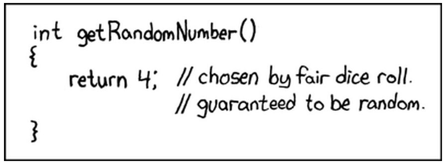

Lecture 29
----------

*Lecture: Tue 6th May 2014  -  Today: Sun 27th April 2014*

- Ellipic curves, but from notes, I can't see any new material
- Fuck it, we'll do it live
- So the exam has now been written!
- Don't really need to understand how Berlecamp-Massey works
    - Just know that it exists, and that it is fairly fast
- Don't need to be able to prove associativity
    - Groups we will get in the exam will be relatively small
- What we know about Elliptic curves:
    - There exists a group operation 
    - Two points (x1, y1) &middot; (x2, y2) = (x3, y3)
    - This is associative, has an inverse and an identity (infinity -- the point straight up)
- Abelian group
- Size (P + 1) +/- 2sqrt(P)
- group is often called E
- E is the product of at most two groups
    - Cyclic abelian groups
- If E is just a single group
    - There will be some elements of very high order 
- If not, the groups will be of the form Zm &times; Zn
    - And m must divide (P - 1) and |E|
- n is quite small, an m is quite big
- Can always find an element g which we can raise to a high power
- Warnings:
    - |E| should not be P + 1
        - because this is Supersignular
        - There are deep and mysterious tricks to solve these 
    - |E| should not be P
        - because these are anomolous
        - There are shortcuts to the discrete log problem
    - YOU GOTTA BE CAREFUL
        - The is no general proof that the discrete logarithm problem is hard:
            - That is given ga and g what is a
        - There are certain curves that we know have shortcuts
- Fields of low characteristic Fq where F is 2, 3 or 5 or something... 
    - The same fields we were using for LFSRs
- Terribly terribly scary
    - Every now and again, we find new curves that are easy to break
    - The NSA is probably one step ahead
- How would you ever know if an Elliptic curve someone gave you was a good one of not?
    - Deep scarey maths
    - Map Elliptic curve to multiplication in a field -- do some factorisation with index calculus
    - YOU AREN'T SUPPOSED TO BE ABLE TO DO THAT SILLY
- Group operation is fast
    - Raising to a high power is quick
- Undoing that (by computing the discrete logarithm) 
    - is relatively hard
    - Except that sometimes there are groups that are not hard :(
- The idea is that you can use much smaller P that you would in field multiplication
    - Using much bigger keys Field multiplication is fine
    - But that is quite processor intensive
    - Embedded devices
- The NSA are probably the only ones who really know what is good and what is bad
- Most modern cryptographers, don't currently believe the standards are broken
    - But maybe the guys who broke Elliplic curves are just very clever
- The other issue is side channel attacks
    - Rare to attack the encryption process head on
    - Try to get extra information from a side channel :)
    - How do we compute ga
        - e.g. g7 = ((g2)2)g
        - e.g. g8 = ((g2)2)2
        - There is a pattern here, 
        - We can tell what is be computed, i.e. what the power was
        - Just by looking at the power consumption, we can work out what the secret a was
        - Pattern of squares and multiples can reveal information
            - The two operations use different types of power
            - Can power analyse doubling and addition...
        - Might even be able to work out bits but watching the power during loading
    - Another potential vulnerability:
        - ga should be a point on the curve in DH
        - usually characterised as x value and pos/neg
        - If you feed in a point not in the curve:
            - You might be able to get it to behave badly :)
- There also may be bugs in this relatively complex software
- Try feeding it a point with y = 0...
    - There are either 0, 1 or 3 of these..
    - That'll produce infinity.. 
    - Hmm, how odd!
- So is the code even well tested?
- Can use Edward's Coordinates
    - This makes things more uniform
    - Things won't blow up so much
- So Elliptic curves are wonderful things
- It is very hard to design an elliptic curve libarary that isn't vulnerable to side channels or funny data. 
- Recall: Roughly half the x points are on the curve...
- Not only have there been many cockups in software implemenations
    - There have also been some that have been planted there
- Complicated interplay between complex mathematics, and backdooring
- Cheeky schemes and Larsony
    - Just simply steal the stuff!
- Yo -- when are you going to come home to mow the lawn?
- AND SO ThE MATERIAL ENDS!

###Tangents 
####Homogenous Coordinates
- We can handle infinity by using homogenous coordinates
- y2z = x3 + Axz2 + Bz3
- You can now represent a point as three elements:
    - (x, y, z) = (&mu;x, &mu;y, &mu;z)
    - x, y, z not all zero. 
    - A way of representing ways throught the origin. 
    - Points/lines on the surface of a sphere
- Tangent within a tengent
    - If you go down a dimenstion
    - You can represent a line in 2D
    - Naively you can just use &theta; as the angle from an axis, through the origin
    - Instead use a peair (x, y) = (&mu;x, &mu;y) x,y both nonzero
    - A one dimensional projected line.
- The point at infinity = (1,0,0)
- x is very big: x = x/z; y = y/z to change back to normal coords
    - Corresponds to very big x, small y.
- The points at infinity are no longer very special...
- Can get rid of the z by scaling the &mu; 
    - This is a bit of an ish when z is zero...

####Standardisation of ECC
- Experts at designing are at princeton (come from Cambridge)
- Experts at breaking are at NSA
- NIST have a close relationship with NSA...
- The NSA has caused NIST to standardise a backdoored EC algo
    - Pseudorandom sequence generator 
    - Thanks to Snowden leaks, we are pretty sure of this
    - If you know one random number, you can work out the next..
- H G; Ga = H
    - if you know what a is you can crack the algorithm
    - Hard if you have to solve discrete log
    - But the NSA specified H
- The knowledge of a makes it very easy to guess the next random number
- Very commonly in HTTPS encyrption, you only generate two random numbers
- NSA paid RSA security to use this particular algo the default
- How scary
- Until the leaks, this was a really good way of doing surveillance
- Sabotaging random number generators is a common way to break cryptosystems
- You can do it on Intel or sommink
- 
- 
- For the customers using RSA's B-Secure, this was the reality...
    - Except it generated a sequence that was analysable by NSA
